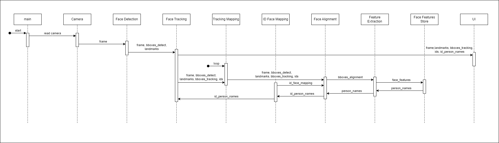

# Face-recognition

Real-Time Face Recognition use SCRFD, ArcFace, ByteTrack and Similarity Measure

<div align = "center">
  <a href="https://medium.com/@jykroo/face-detection-tracking-and-recognition-system-using-scrfd-bytetracker-and-arcface-06f64bcb2458" target="_blank" rel="noopener noreferrer" style="margin-right: 50px;">
    
  </a>
</div>

## Table of Contents

- [Architecture](#architecture)
- [How to use](#how-to-use)
  - [Create Environment and Install Packages](#create-environment-and-install-packages)

## Architecture

   <p align="center">
   
   <br>
   <em>Sequence Diagram - click to view</em>
   </p>

## How to use

### Create Environment and Install Packages

```shell
conda create -n face-dev python=3.9
```

```shell
conda activate face-dev
```

```shell
pip install torch==1.9.1+cpu torchvision==0.10.1+cpu torchaudio==0.9.1 -f https://download.pytorch.org/whl/torch_stable.html
pip install -r requirements.txt
```
